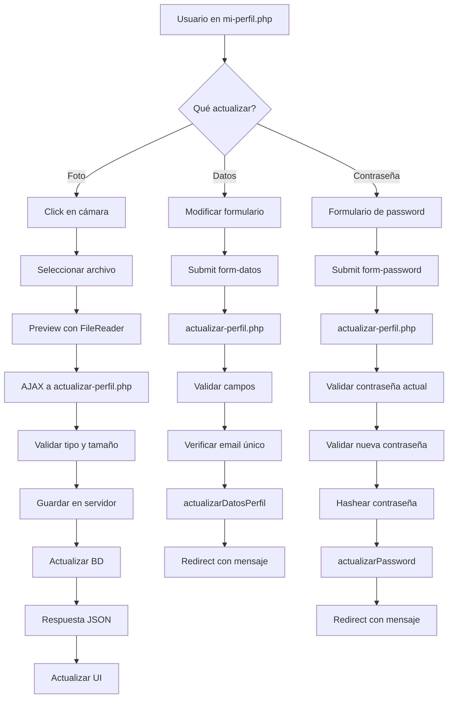

# Sistema de Administración de Usuarios y Perfil

## 📋 Índice
1. [Descripción General](#descripción-general)
2. [Archivos Creados](#archivos-creados)
3. [Funcionalidades](#funcionalidades)
4. [Guía de Uso](#guía-de-uso)
5. [Validaciones y Seguridad](#validaciones-y-seguridad)
6. [Métodos de Clase Usuario](#métodos-de-clase-usuario)
7. [Variables de Sesión](#variables-de-sesión)

---

## 📝 Descripción General

Se ha implementado un sistema completo de administración de usuarios y gestión de perfil personal que incluye:

- **Administración de usuarios** (solo para administradores)
- **Perfil personal** (para todos los usuarios)
- **Carga de foto de perfil**
- **Cambio de contraseña**
- **Actualización de datos personales**

---

## 📂 Archivos Creados

### Páginas Principales

#### 1. `usuarios.php`
**Propósito:** Página de administración de usuarios (solo admin)

**Características:**
- Requiere rol `admin` para acceder
- Muestra 4 tarjetas de estadísticas:
  - Total de usuarios
  - Usuarios activos
  - Cantidad de roles
  - Usuarios nuevos (últimos 30 días)
- Tabla con DataTables mostrando:
  - Foto de perfil
  - Nombre completo
  - Email
  - Cédula
  - Teléfono
  - Rol
  - Empresa
  - Estado (Activo/Inactivo)
  - Acciones (Editar/Eliminar)
- Búsqueda, paginación y ordenamiento
- Idioma español en DataTables

**Código importante:**
```php
// Verificar permisos de administrador
$Usuario_class->verificarPermisos('admin');

// Obtener todos los usuarios
$usuarios = $Usuario_class->obtenerUsuarios();

// Estadísticas
$total_usuarios = count($usuarios);
$usuarios_activos = count(array_filter($usuarios, fn($u) => $u['estado'] == 1));
```

#### 2. `mi-perfil.php`
**Propósito:** Página de perfil personal (todos los usuarios)

**Características:**
- Accesible para cualquier usuario autenticado
- Diseño en 2 columnas:
  
  **Columna izquierda:**
  - Foto de perfil (circular con botón de cámara para cambiar)
  - Nombre completo y rol
  - Información personal (email, cédula, teléfono, dirección, fecha registro)
  
  **Columna derecha:**
  - Formulario de edición de datos personales
  - Formulario de cambio de contraseña
  - Recomendaciones de seguridad

**Secciones:**

1. **Información del Perfil**
   - Vista previa de foto con opción de cambio
   - Datos personales de solo lectura

2. **Editar Datos Personales**
   - Nombre
   - Apellido
   - Email
   - Teléfono
   - Dirección

3. **Cambiar Contraseña**
   - Contraseña actual
   - Nueva contraseña (mínimo 8 caracteres)
   - Confirmar nueva contraseña
   - Botones para mostrar/ocultar contraseñas

### Archivos de Backend

#### 3. `action/actualizar-perfil.php`
**Propósito:** Procesar las actualizaciones del perfil

**Funciones:**

1. **Subir Imagen de Perfil**
   - Acepta: POST con `$_FILES['imagen_perfil']`
   - Formatos permitidos: JPG, PNG, GIF
   - Tamaño máximo: 5MB
   - Genera nombre único: `user_{id}_{timestamp}.{ext}`
   - Elimina imagen anterior automáticamente
   - Responde en JSON para AJAX

```php
// Ejemplo de respuesta JSON
{
    "success": true,
    "message": "Foto de perfil actualizada correctamente",
    "imagen_url": "assets/images/users/user_1_1234567890.jpg"
}
```

2. **Actualizar Datos Personales**
   - Acepta: POST con `actualizar_datos`
   - Valida campos requeridos
   - Verifica formato de email
   - Comprueba que email no esté duplicado
   - Actualiza: nombre, apellido, email, teléfono, dirección

3. **Cambiar Contraseña**
   - Acepta: POST con `cambiar_password`
   - Valida contraseña actual
   - Verifica longitud mínima (8 caracteres)
   - Confirma que las contraseñas coincidan
   - Hashea nueva contraseña con `password_hash()`

**Validaciones implementadas:**
```php
// Tipo de archivo
if (!in_array($file['type'], ['image/jpeg', 'image/png', 'image/jpg', 'image/gif'])) {
    // Error
}

// Tamaño de archivo
if ($file['size'] > 5 * 1024 * 1024) { // 5MB
    // Error
}

// Email duplicado
$email_existe = $Usuario_class->verificarEmailExistente($email, $user_id);

// Contraseña actual correcta
if (!password_verify($password_actual, $usuario['password'])) {
    // Error
}
```

---

## 🔧 Métodos de Clase Usuario

Se agregaron 4 nuevos métodos a `includes/Class-usuario.php`:

### 1. `actualizarImagenPerfil($id_usuario, $imagen_url)`
**Propósito:** Actualizar la ruta de la imagen de perfil en la BD

```php
public function actualizarImagenPerfil($id_usuario, $imagen_url) {
    $query = "UPDATE usuarios SET imagen_perfil = :imagen_url WHERE id = :id";
    $stmt = $this->conn->prepare($query);
    
    $stmt->bindParam(':imagen_url', $imagen_url);
    $stmt->bindParam(':id', $id_usuario);
    
    return $stmt->execute();
}
```

**Uso:**
```php
$Usuario_class->actualizarImagenPerfil(1, 'assets/images/users/user_1_123456.jpg');
```

---

### 2. `verificarEmailExistente($email, $id_usuario_excluir = null)`
**Propósito:** Verificar si un email ya está registrado

```php
public function verificarEmailExistente($email, $id_usuario_excluir = null) {
    if ($id_usuario_excluir) {
        $query = "SELECT COUNT(*) as total FROM usuarios 
                  WHERE email = :email AND id != :id";
        $stmt = $this->conn->prepare($query);
        $stmt->bindParam(':email', $email);
        $stmt->bindParam(':id', $id_usuario_excluir);
    } else {
        $query = "SELECT COUNT(*) as total FROM usuarios WHERE email = :email";
        $stmt = $this->conn->prepare($query);
        $stmt->bindParam(':email', $email);
    }
    
    $stmt->execute();
    $result = $stmt->fetch(PDO::FETCH_ASSOC);
    
    return $result['total'] > 0;
}
```

**Uso:**
```php
// Verificar si email existe (para registro)
$existe = $Usuario_class->verificarEmailExistente('nuevo@email.com');

// Verificar si email existe excluyendo usuario actual (para edición)
$existe = $Usuario_class->verificarEmailExistente('nuevo@email.com', 5);
```

---

### 3. `actualizarDatosPerfil($id_usuario, $datos)`
**Propósito:** Actualizar datos personales del usuario

```php
public function actualizarDatosPerfil($id_usuario, $datos) {
    $query = "UPDATE usuarios SET 
              first_name = :first_name,
              last_name = :last_name,
              email = :email,
              phone = :phone,
              direccion = :direccion
              WHERE id = :id";
    
    $stmt = $this->conn->prepare($query);
    
    // Asignar a variables para bindParam
    $first_name = $datos['first_name'];
    $last_name = $datos['last_name'];
    $email = $datos['email'];
    $phone = $datos['phone'];
    $direccion = $datos['direccion'];
    
    $stmt->bindParam(':first_name', $first_name);
    $stmt->bindParam(':last_name', $last_name);
    $stmt->bindParam(':email', $email);
    $stmt->bindParam(':phone', $phone);
    $stmt->bindParam(':direccion', $direccion);
    $stmt->bindParam(':id', $id_usuario);
    
    return $stmt->execute();
}
```

**Uso:**
```php
$datos = [
    'first_name' => 'Juan',
    'last_name' => 'Pérez',
    'email' => 'juan@email.com',
    'phone' => '3001234567',
    'direccion' => 'Calle 123 #45-67'
];

$Usuario_class->actualizarDatosPerfil(1, $datos);
```

---

### 4. `actualizarPassword($id_usuario, $password_hash)`
**Propósito:** Actualizar la contraseña de un usuario

```php
public function actualizarPassword($id_usuario, $password_hash) {
    $query = "UPDATE usuarios SET password = :password WHERE id = :id";
    $stmt = $this->conn->prepare($query);
    
    $stmt->bindParam(':password', $password_hash);
    $stmt->bindParam(':id', $id_usuario);
    
    return $stmt->execute();
}
```

**Uso:**
```php
$password_nueva = 'mi_nueva_contraseña';
$password_hash = password_hash($password_nueva, PASSWORD_DEFAULT);

$Usuario_class->actualizarPassword(1, $password_hash);
```

---

## 🔒 Validaciones y Seguridad

### Validaciones de Imagen

```php
// Tipos permitidos
$allowed_types = ['image/jpeg', 'image/png', 'image/jpg', 'image/gif'];

// Tamaño máximo
$max_size = 5 * 1024 * 1024; // 5MB

// Nombre único
$filename = 'user_' . $user_id . '_' . time() . '.' . $extension;
```

### Validaciones de Datos

```php
// Email válido
if (!filter_var($email, FILTER_VALIDATE_EMAIL)) {
    $_SESSION['error'] = 'El formato del email no es válido';
}

// Email no duplicado
$email_existe = $Usuario_class->verificarEmailExistente($email, $user_id);
if ($email_existe) {
    $_SESSION['error'] = 'El email ya está registrado';
}

// Campos requeridos
if (empty($first_name) || empty($last_name) || empty($email)) {
    $_SESSION['error'] = 'Completa todos los campos obligatorios';
}
```

### Validaciones de Contraseña

```php
// Longitud mínima
if (strlen($password_nueva) < 8) {
    $_SESSION['error'] = 'La contraseña debe tener al menos 8 caracteres';
}

// Contraseñas coinciden
if ($password_nueva !== $password_confirmar) {
    $_SESSION['error'] = 'Las contraseñas no coinciden';
}

// Contraseña actual correcta
if (!password_verify($password_actual, $usuario['password'])) {
    $_SESSION['error'] = 'La contraseña actual es incorrecta';
}
```

### Seguridad de Archivos

```php
// Eliminar imagen anterior al subir nueva
if (!empty($usuario_actual['imagen_perfil']) && 
    $usuario_actual['imagen_perfil'] !== 'assets/images/users/user-default.png' &&
    file_exists('../' . $usuario_actual['imagen_perfil'])) {
    unlink('../' . $usuario_actual['imagen_perfil']);
}

// Eliminar archivo si falla actualización BD
if (file_exists($filepath)) {
    unlink($filepath);
}
```

---

## 🔑 Variables de Sesión

Se agregaron las siguientes variables de sesión en `action/valide-usuario.php`:

```php
$_SESSION['user_id']              // ID del usuario
$_SESSION['user_img']             // Ruta de imagen (legacy)
$_SESSION['user_imagen']          // Ruta de imagen (nuevo)
$_SESSION['user_nombre']          // Nombre completo
$_SESSION['user_first_name']      // Nombre
$_SESSION['user_last_name']       // Apellido
$_SESSION['user_email']           // Email
$_SESSION['user_phone']           // Teléfono
$_SESSION['user_direccion']       // Dirección
$_SESSION['user_rol']             // Rol (admin, conductor, mantenimiento)
$_SESSION['user_empresa_id']      // ID de la empresa
$_SESSION['user_token']           // Token de seguridad
```

---

## 🎯 Guía de Uso

### Para Administradores

**1. Acceder a la administración de usuarios:**
```
Sidebar → Usuarios
O directamente: usuarios.php
```

**2. Ver estadísticas:**
- Total de usuarios en el sistema
- Cuántos están activos
- Cantidad de roles diferentes
- Usuarios nuevos del último mes

**3. Gestionar usuarios:**
- Ver lista completa con DataTables
- Buscar por cualquier campo
- Editar datos de usuario (botón Editar)
- Eliminar usuario (botón Eliminar con confirmación)

**4. Ordenar y filtrar:**
- Click en encabezados de columna para ordenar
- Usar el campo de búsqueda global
- Cambiar cantidad de registros por página

### Para Todos los Usuarios

**1. Acceder al perfil:**
```
Sidebar → Mi Cuenta → Mi Perfil
O click en tu nombre/foto en el sidebar
```

**2. Cambiar foto de perfil:**
- Click en el icono de cámara sobre la foto
- Seleccionar imagen (JPG, PNG, GIF - máx 5MB)
- La foto se sube automáticamente
- Actualización en tiempo real

**3. Actualizar datos personales:**
- Modificar nombre, apellido, email, teléfono o dirección
- Click en "Guardar Cambios"
- Validación automática del email

**4. Cambiar contraseña:**
- Ingresar contraseña actual
- Ingresar nueva contraseña (mín 8 caracteres)
- Confirmar nueva contraseña
- Click en "Cambiar Contraseña"
- Recomendaciones de seguridad visibles

---

## 🚀 Funcionalidades JavaScript

### Preview de Imagen

```javascript
document.getElementById('imagen-perfil').addEventListener('change', function(e) {
    const file = e.target.files[0];
    if (file) {
        const reader = new FileReader();
        reader.onload = function(e) {
            document.getElementById('preview-imagen').src = e.target.result;
        }
        reader.readAsDataURL(file);
        
        // Subir automáticamente
        subirImagen(file);
    }
});
```

### Subida con AJAX

```javascript
function subirImagen(file) {
    const formData = new FormData();
    formData.append('imagen_perfil', file);

    fetch('action/actualizar-perfil.php', {
        method: 'POST',
        body: formData
    })
    .then(response => response.json())
    .then(data => {
        if (data.success) {
            // Actualizar imagen en header
            const headerImg = document.querySelector('.topnav .dropdown-toggle img');
            if (headerImg) {
                headerImg.src = data.imagen_url;
            }
        }
    });
}
```

### Toggle Password

```javascript
function togglePassword(inputId) {
    const input = document.getElementById(inputId);
    const icon = document.getElementById('icon-' + inputId);
    
    if (input.type === 'password') {
        input.type = 'text';
        icon.className = 'mdi mdi-eye-off';
    } else {
        input.type = 'password';
        icon.className = 'mdi mdi-eye';
    }
}
```

### Validación de Contraseñas

```javascript
document.getElementById('form-password').addEventListener('submit', function(e) {
    const nueva = document.getElementById('password_nueva').value;
    const confirmar = document.getElementById('password_confirmar').value;
    
    if (nueva !== confirmar) {
        e.preventDefault();
        alert('Las contraseñas no coinciden');
        return false;
    }
});
```

---

## 📊 Estructura de Base de Datos

### Tabla: `usuarios`

```sql
CREATE TABLE usuarios (
    id INT PRIMARY KEY AUTO_INCREMENT,
    code_cc VARCHAR(20) UNIQUE,
    first_name VARCHAR(100),
    last_name VARCHAR(100),
    email VARCHAR(150) UNIQUE,
    password VARCHAR(255),
    phone VARCHAR(20),
    direccion TEXT,
    imagen_perfil VARCHAR(255),
    rol ENUM('admin', 'conductor', 'mantenimiento'),
    id_empresa INT,
    estado TINYINT(1) DEFAULT 1,
    created_at TIMESTAMP DEFAULT CURRENT_TIMESTAMP,
    updated_at TIMESTAMP DEFAULT CURRENT_TIMESTAMP ON UPDATE CURRENT_TIMESTAMP
);
```

---

## ✅ Checklist de Implementación

- [x] Página de administración de usuarios (usuarios.php)
- [x] Página de perfil personal (mi-perfil.php)
- [x] Backend de actualización (action/actualizar-perfil.php)
- [x] 4 métodos nuevos en Class-usuario.php
- [x] Variables de sesión actualizadas
- [x] Sidebar actualizado con enlaces
- [x] Imagen por defecto (user-default.png)
- [x] Validaciones de seguridad
- [x] Subida de imágenes con AJAX
- [x] Cambio de contraseña seguro
- [x] DataTables en español
- [x] Responsive design
- [x] Mensajes de éxito/error
- [x] Documentación completa

---

## 🎨 Estilos CSS Personalizados

```css
/* Contenedor de imagen de perfil */
.profile-image-container {
    position: relative;
    width: 150px;
    height: 150px;
    margin: 0 auto;
}

/* Imagen circular */
.profile-image {
    width: 150px;
    height: 150px;
    object-fit: cover;
    border: 4px solid #fff;
    box-shadow: 0 0 20px rgba(0,0,0,0.1);
}

/* Botón de cámara */
.profile-image-upload {
    position: absolute;
    bottom: 0;
    right: 0;
    background: #727cf5;
    color: white;
    width: 40px;
    height: 40px;
    border-radius: 50%;
    cursor: pointer;
}

/* Items de información */
.info-item {
    padding: 12px 0;
    border-bottom: 1px solid #f1f3fa;
}
```

---

## 🔄 Flujo de Actualización de Perfil



---

## 📝 Notas Importantes

1. **Permisos de Carpeta:**
   - La carpeta `assets/images/users/` debe tener permisos de escritura
   - En Linux/Mac: `chmod 777 assets/images/users/`

2. **Tamaño de Archivo PHP:**
   - Verificar `upload_max_filesize` en php.ini (mínimo 5MB)
   - Verificar `post_max_size` en php.ini (mínimo 8MB)

3. **Sesiones:**
   - Las variables de sesión se actualizan solo en login
   - Para reflejar cambios de perfil, el usuario debe cerrar sesión y volver a entrar
   - O implementar actualización de sesión después de editar perfil

4. **Imágenes:**
   - Formato recomendado: JPG (mejor compresión)
   - Tamaño recomendado: 300x300px o 500x500px
   - Se genera nombre único para evitar caché de navegador

---

## 🚧 Mejoras Futuras

- [ ] Crop de imagen antes de subir
- [ ] Compresión automática de imágenes
- [ ] Actualizar sesión después de editar perfil
- [ ] Historial de cambios de contraseña
- [ ] Verificación de email al cambiar
- [ ] Autenticación de dos factores (2FA)
- [ ] Límite de intentos de login
- [ ] Recuperación de contraseña por email
- [ ] Activación de cuenta por email
- [ ] Registro de actividad del usuario
- [ ] Políticas de contraseña configurables
- [ ] Vista previa de imagen antes de confirmar

---

## 📞 Soporte

Para cualquier problema o duda:
1. Verificar los logs de PHP
2. Revisar permisos de carpetas
3. Verificar configuración de php.ini
4. Comprobar conexión a base de datos
5. Revisar variables de sesión

---

**Documentación creada:** <?php echo date('Y-m-d H:i:s'); ?>
**Versión:** 1.0
**Sistema:** Sysmaint Web - Gestión de Mantenimiento
